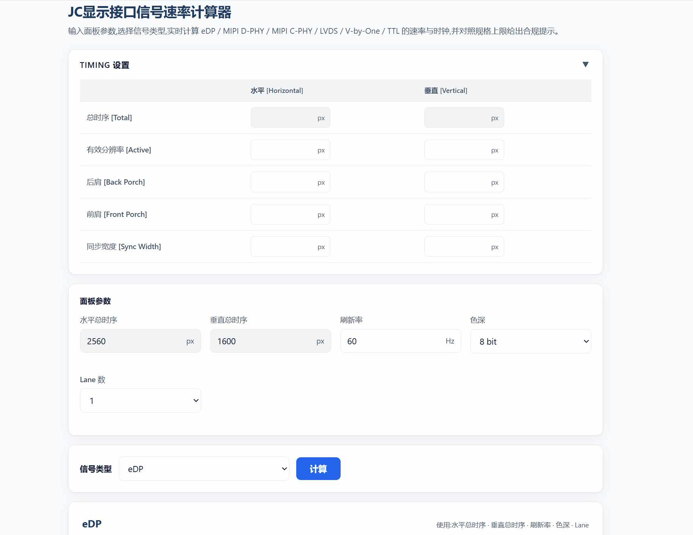

# JC 显示接口信号速率计算器

> 一个**单文件、离线、零依赖**的浏览器工具,用于计算常见显示接口(eDP / MIPI D-PHY / MIPI C-PHY / LVDS / V-by-One / TTL / HDMI)的信号速率与时钟,并对照规格上限给出**合规判定**与**挡位适配建议**。

> **当前版本:v1.3.0** · 版本变更记录见 [CHANGELOG.md](./CHANGELOG.md)

输入一组面板参数,通过下拉框切换信号类型,即可实时查看该接口的速率/时钟结果、规格是否超标,以及最合适的挡位 / 通道配置。

<p align="center">
  
</p>

---

## ✨ 功能特性

- **7 种信号类型**一站式计算:eDP、MIPI D-PHY、MIPI C-PHY、LVDS、V-by-One、TTL、HDMI。
- **Timing 设置**:可折叠面板,支持输入水平/垂直子参数(Active、Back Porch、Front Porch、Sync Width)自动计算总时序。
- **实时计算**:输入即算;另提供"计算"按钮强制校验全部字段并重算。
- **规格合规检查**:对照各接口的速率/时钟上限,给出 ✅ 在规格内 / ⚠️ 超规格 提示。
- **挡位 / 通道适配**:
  - eDP:DP 1.4 / DP 2.0 双公式,自动匹配 DP(DP 1.4)、ALPDP(DP 1.4)、ALPDP(DP 2.0) 挡位。
  - MIPI D-PHY:4 组公式(速率档位 × 时钟模式),自洽高亮。
  - LVDS:按单 / 双 / 四 / 八通道给出可用范围与建议。
  - C-PHY:按 2832 芯片 / TTL 数给出配置建议。
  - HDMI:HDMI 1.4 / 2.0 对比表格,TMDS带宽合规判定。
- **输入校验**:非空、数字、合理范围校验;非法输入不产生错误结果。
- **响应式 + 无障碍**:系统字体、可见焦点、`prefers-reduced-motion`、窄屏自适应。
- **完全离线**:HTML + CSS + JS 全部内联,双击即可在浏览器打开,不联网、不依赖任何 CDN。

---

## 🚀 快速开始

直接双击打开 `显示接口信号计算器v1.3.0.html` 即可使用(推荐 Chrome / Edge / Firefox)。

无需安装、无需构建、无需联网。

---

## 🧮 支持的信号类型

| 信号 | 核心公式 | 关键输出 | 规格上限 |
|---|---|---|---|
| **eDP** | `H×V×刷新率×(色深×3)×{1.25 \| 1.05}/Lane`(DP 1.4 / DP 2.0) | DP 1.4 / DP 2.0 速率 + 挡位适配 | DP 1.4:1.62/2.7/5.4/8.1;ALPDP 1.4:含 2.16/3.24/3.78/4.32;ALPDP 2.0:8.1/10/13.5/20 Gbps |
| **MIPI D-PHY** | `(H+加数)×V×刷新率×色深×3/Lane`(加数 +95/+190/+145/+255) | DSI 速率 | DSI ≤ **2.5 Gbps/Lane** |
| **MIPI C-PHY** | 像素时钟=`H×V×刷新率÷10⁶`;DSI=`H×V×刷新率×3×色深×1.2/(Lane×2.28)` | 像素时钟 + DSI(sps) | 像素时钟 ≤640 MHz(361 平台);DSI ≤ **1.5 Gsps/Lane** |
| **LVDS** | 像素时钟=`H×V×刷新率÷10⁶`;PCLK=像素时钟÷Link数 | Single-link PCLK + 总像素时钟 | 单/双/四/八通道:10–135 / 20–270 / 40–540 / 80–1080 MHz(@0.1MHz 步进) |
| **V-by-One** | `H总×V总×(色深×3)×1.25×刷新率/Lane` | Lane 数据速率 | ≤ **3.75 Gbps/Lane** |
| **TTL** | `H×V×刷新率`(= 传输速率,单边沿) | 时钟频率 / 速率 | ≤ **100 Mbps** |
| **HDMI** | 像素时钟=`H×V×刷新率÷10⁶`;TMDS=`像素时钟×1.25`(1.4) / `像素时钟×1.25÷4`(2.0) | TMDS时钟 + TMDS带宽 | TMDS带宽 ≤ **18 Gbps** |

> 完整公式、常数、阈值与判定分支见 [`显示接口信号规格&计算公式汇总.md`](./显示接口信号规格&计算公式汇总.md)。

---

## 📥 输入参数

### Timing 设置(可折叠)

位于页面顶部,默认折叠。展开后可通过子参数自动计算总时序:

| 参数 | 说明 | 公式 |
|---|---|---|
| 总时序 [Total] | 自动计算,不可编辑 | H_TOTAL = Active + Back Porch + Front Porch + Sync Width |
| 有效分辨率 [Active] | 水平/垂直有效像素数 | — |
| 后肩 [Back Porch] | 水平/垂直后肩 | — |
| 前肩 [Front Porch] | 水平/垂直前肩 | — |
| 同步宽度 [Sync Width] | 水平/垂直同步宽度 | — |

> 展开 Timing 面板时,"面板参数"中的水平/垂直总时序自动变为只读;折叠后恢复可编辑。

### 共享面板(始终显示)

| 参数 | 单位 | 默认 | 说明 |
|---|---|---|---|
| 水平总时序 | px | 2560 | 正数(可由 Timing 面板自动计算) |
| 垂直总时序 | px | 1600 | 正数(可由 Timing 面板自动计算) |
| 刷新率 | Hz | 60 | 正数 |
| 色深 | bit | 8 | 下拉:8 / 10 / 12 |
| Lane 数 | — | 1 | 下拉:1 / 2 / 4 / 8 / 16 / 32 |

联动:
- **LVDS**:Lane 数切换为 **Link 数**(单 / 双 / 四 / 八通道),不使用色深。
- **TTL**:隐藏 Lane 数,不使用色深。
- **V-by-One**:使用**总时序 / 色深 / Lane**,按 `H总×V总×(色深×3)×1.25×刷新率/Lane` 计算;Timing 面板自动求和同样生效。
- **HDMI**:色深固定 10bit(不可修改)、Symbol per clock=1,隐藏 Lane 数。

---

## 📁 项目结构

```
DSI-Calculation/
├── 显示接口信号计算器v1.3.0.html    # 单文件计算工具(HTML + CSS + JS)
├── 显示接口信号规格&计算公式汇总.md  # 完整公式 / 规格 / 判定规则文档
├── README.md
├── CHANGELOG.md                    # 版本变更记录
├── demo.gif                        # 演示动图
└── docs/
    └── superpowers/specs/
        └── 2026-07-14-rate-calc-tool-design.md   # 设计规格(SPEC)
```

---

## 🛠 技术栈

- 纯原生 **HTML / CSS / JavaScript**(ES5 兼容写法),无框架、无构建。
- 系统字体栈,内嵌 CSS,无任何外部资源。

---

## 📐 计算示例

| 场景 | 信号 | 输入 | 结果 |
|---|---|---|---|
| 1080P 60Hz 8bit 4Lane | DP(原 DP 举例) | 2200 / 1125 / 60 / 8bit / 4 | ≈ 1.11 Gbps/Lane |
| 720×1280 手机屏 | MIPI D-PHY | 816 / 1340 / 60 / 8bit / 4 | 4 行:439.47 / 485.29 / 463.59 / 516.65 Mbps |
| 1080P 60Hz | LVDS | 2200 / 1125 / 60 | 总 148.5 MHz(双链路) |
| 4K60 10bit 8Lane | V-by-One | 4400 / 2250 / 60 / 10bit / 8 | ≈ 2.78 Gbps/Lane |
| 1080×1920 60Hz 8bit 3Lane | MIPI C-PHY | 1200 / 1980 / 60 / 8bit / 3 | 142.56 MHz / 600.25 Msps |
| 800×480 工控屏 | TTL | 928 / 525 / 60 | 29.23 MHz / Mbps |
| 1080P 60Hz | HDMI | 2200 / 1125 / 60 | 像素时钟 148.5 MHz;1.4:1.86 Gbps / 2.0:0.46 Gbps |

---

## 📝 说明

- 结果仅供工程参考,实际设计请以芯片原厂规格书为准。
- 各接口规格阈值、挡位定义集中在 [`显示接口信号规格&计算公式汇总.md`](./显示接口信号规格&计算公式汇总.md)。

---

## 👤 作者

**AomeNero** · <https://github.com/AomeNero/DSI-Calculation>
